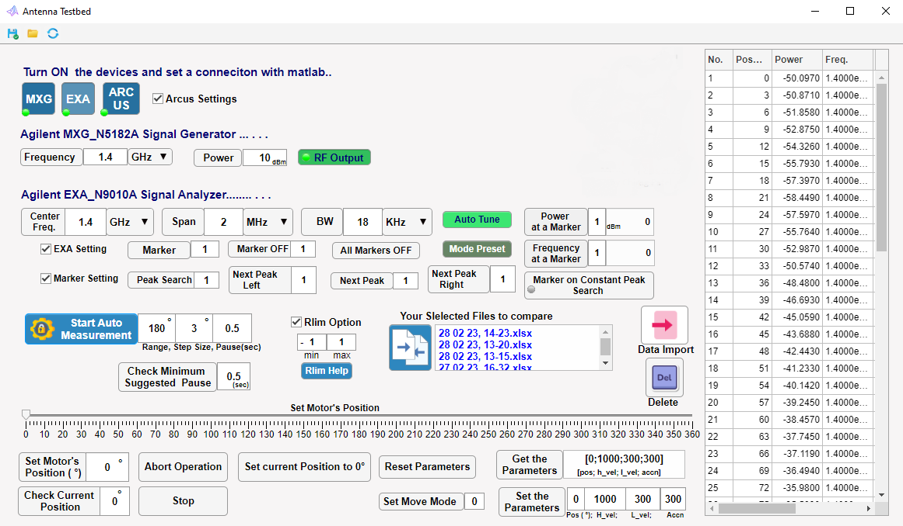

# High-frequency Antenna Directional Characteristics Testbed

This repository contains the software developed for the comprehensive study of the directional characteristics of various antennas/radar systems. The software is designed to work in conjunction with a testbed environment, providing valuable insights into the performance of antennas in communication systems.

## Testbed Environment

The testbed environment is equipped with advanced hardware systems that aid in the study of the directional characteristics of antennas. The hardware components include:

- Keysight EXA N9010A signal analyser (9 kHz to 7 GHz)
- Keysight MXG N5182A signal generator (100 kHz to 6 GHz)
- Keysight PNA N5222A network analyzer
- Arcus Technology stepper motor model DMX-J-SA-17
- Hyper LOG 4060 Broadband antenna
- Various types of antennas with their own frequency ranges

## Software Development

The software is developed using MATLAB programming language that supports the VISA-IP address through an Ethernet connection as an Application Programming Interface (API). This allows for script writing and code generation that can control the hardware components and collect data from the antennas.

## Objective

The primary objective of this software is to provide a tool for investigating the directional characteristics of antennas. It works in conjunction with FEKO simulation software and antenna analysis systems to provide useful information about the performance of antennas in communication systems. The software compares simulation results with actual practical results, thereby confirming the accuracy of the simulation and contributing to the development of the field of communication technology.

Please refer to the individual directories for more detailed information on the setup, usage, and contribution guidelines.

